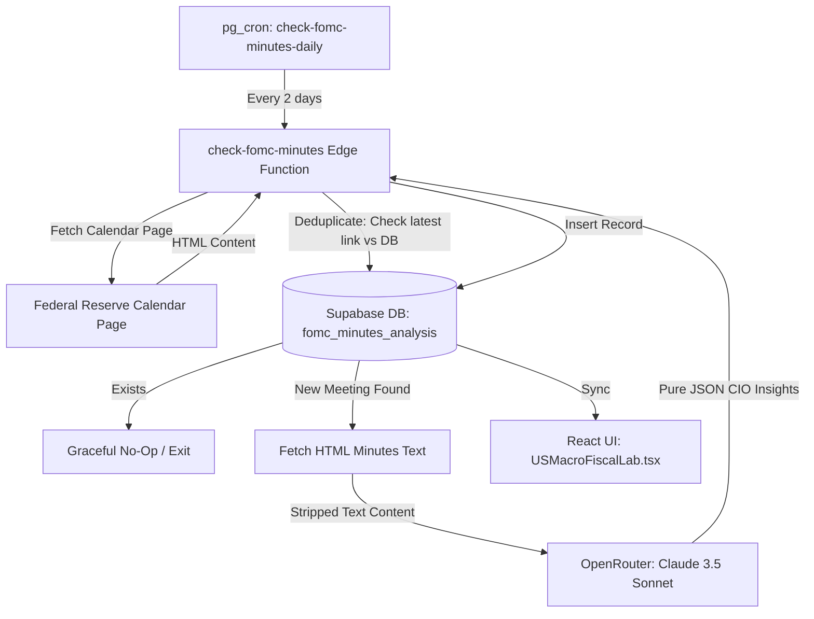

# FOMC Minutes Intelligence & Analysis Integration Design Spec

## Goal & Background Context
To automatically detect the release of new Federal Open Market Committee (FOMC) Minutes from the official Federal Reserve website, parse the content of the released HTML minutes, generate high-quality strategic macroeconomic and sovereign portfolio allocation insights using OpenRouter (Claude 3.5 Sonnet), and display structured actionable intelligence inside the GraphiQuestor **US Macro & Fiscal Lab** platform.

This enables immediate, fully-automated assessment of central bank monetary policy shifts without manual scraping or interpretation delay.

---

## Architectural Workflow


---

## Component Details

### 1. Database Schema & Migration
We will create a new table `public.fomc_minutes_analysis` to store the parsed minutes intelligence.

```sql
CREATE TABLE IF NOT EXISTS public.fomc_minutes_analysis (
    id UUID DEFAULT gen_random_uuid() PRIMARY KEY,
    meeting_date DATE NOT NULL UNIQUE,
    release_date DATE NOT NULL,
    overall_tone VARCHAR(50) NOT NULL,
    key_themes JSONB NOT NULL,
    notable_shifts TEXT NOT NULL,
    capital_implications TEXT NOT NULL,
    actionable_insight TEXT NOT NULL,
    raw_analysis TEXT NOT NULL,
    pdf_url TEXT,
    created_at TIMESTAMPTZ DEFAULT NOW()
);

-- Row Level Security (RLS)
ALTER TABLE public.fomc_minutes_analysis ENABLE ROW LEVEL SECURITY;

-- Select policy: Allow anyone to read
CREATE POLICY "Allow public read access on fomc_minutes_analysis"
    ON public.fomc_minutes_analysis FOR SELECT
    TO public
    USING (true);

-- Insert/Update policy: Restricted to service_role (Edge Functions)
CREATE POLICY "Allow service_role full access on fomc_minutes_analysis"
    ON public.fomc_minutes_analysis FOR ALL
    TO service_role
    USING (true)
    WITH CHECK (true);

-- Indexes
CREATE INDEX IF NOT EXISTS idx_fomc_minutes_analysis_meeting_date ON public.fomc_minutes_analysis(meeting_date);
```

#### Scheduled Cron Job
A recurring `pg_cron` schedule will run every 2 days to trigger the edge function:
```sql
SELECT cron.schedule(
  'check-fomc-minutes-daily',
  '0 6 */2 * *', -- 06:00 UTC every 2 days
  $$
    select net.http_post(
      url:='https://debdriyzfcwvgrhzzzre.supabase.co/functions/v1/check-fomc-minutes',
      headers:=jsonb_build_object(
        'Content-Type', 'application/json',
        'Authorization', 'Bearer ' || (select decrypted_secret from vault.decrypted_secrets where name = 'SUPABASE_SERVICE_ROLE_KEY')
      ),
      timeout_milliseconds:=600000
    );
  $$
);
```

---

### 2. Edge Function (`check-fomc-minutes`)
*   **Path:** `supabase/functions/check-fomc-minutes/index.ts`
*   **Logic:**
    1.  Fetches `https://www.federalreserve.gov/monetarypolicy/fomccalendars.htm`.
    2.  Extracts all links matching `/monetarypolicy/fomcminutes(\d{8})\.htm`.
    3.  Parses the latest date `YYYYMMDD` from the URL matching the current calendar year.
    4.  Queries the database to check if this date has been ingested. If it has, returns early.
    5.  Fetches `https://www.federalreserve.gov/monetarypolicy/fomcminutesYYYYMMDD.htm`.
    6.  Strips HTML boilerplate and retrieves cleaned plain text.
    7.  Submits the cleaned text to OpenRouter (`anthropic/claude-3.5-sonnet`) with the elite CIO prompt.
    8.  Parses the response and upserts it into the Supabase database.
    9.  Logs execution telemetry and sends a Discord alert on failures or major new releases.

---

### 3. Frontend React Component (`FOMCMinutesAnalysisCard`)
*   **Path:** `src/components/labs/FOMCMinutesAnalysisCard.tsx`
*   **Visual Elements:**
    *   **Header:** Dynamic title, Meeting & Release Dates.
    *   **Tone Badge:** Large high-fidelity gradient indicator showing Hawkish, Dovish, or Neutral stance with a pulsing visual pulse.
    *   **Key Themes:** Responsive pill list layout with micro-hover glows.
    *   **Shifts & Capital Implications:** Clear two-column side-by-side cards highlighting policy adjustments and strategic portfolio changes.
    *   **Actionable Advisory Callout:** Highlighted gold/amber border block summarizing immediate wealth portfolio recommendations.
    *   **Qualitative Analysis Accordion:** Standard markdown renderer that opens a premium detailed CIO analysis panel.
    *   **Source Reference:** Direct hyperlink to the Fed minutes webpage.

---

## Resiliency & Error Handling
1.  **Duplicate Protection:** The database unique constraint on `meeting_date` protects against duplicate LLM invocations and inserts.
2.  **HTML Structure Resiliency:** Standard tags (`<script>`, `<style>`, `head`, header/footer elements) are fully cleaned via regex before context construction to reduce token waste.
3.  **Expedited Retries:** Scheduled cron job utilizes standard 10-minute timeout bounds to prevent premature connection terminations during heavy OpenRouter invocations.
4. **Check for PDF content:** The content is available as clean HTML or needs PDF parsing. It needs to be parsed accordingly. If PDF is detected, download it and parse it using a PDF parsing library. The PDF URL should be stored in the database for reference. 
5. **PDF Parsing:**
    *   Use pdf-parse package for Node.js to extract text from PDF.
    *   The parsed text should be used as input to the LLM for analysis. 
    *   The parsed text should be stored in the database for reference. 
6. **Limit tokens:** The parsed text should be limited to the first 30000 tokens to prevent exceeding the LLM's token limit. 
7. **Limit stored text:** The parsed text should be limited to the first 30000 tokens to prevent exceeding the LLM's token limit. 
8. **Limit date:** The parsed text should be limited to the first 30000 tokens to prevent exceeding the LLM's token limit. 


    
---

## Verification Plan

### Automated/Local Tests
*   Run the Supabase Edge Function locally using `supabase functions serve` or by calling it directly using cURL with a custom query parameter (e.g. `check-fomc-minutes?test=true` or similar mockup parameters).
*   Verify output JSON parsing correctness.
*   Validate database record creation.

### Manual Verification
*   Check the dashboard `src/pages/labs/USMacroFiscalLab.tsx` locally to confirm the card renders correctly with mock or ingested data.
*   Validate responsiveness and hover behaviors in modern desktop sizes.
