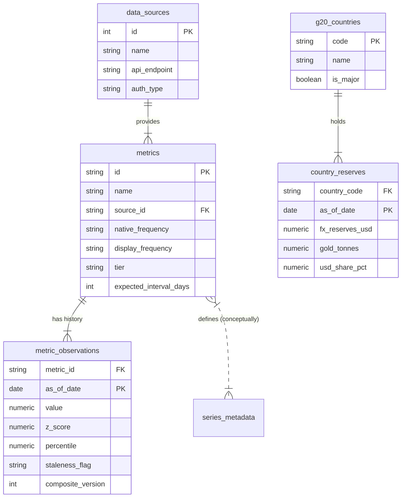

# Database Schema – Entity Relationship Diagram

This document describes the core entity relationships for the Macro Intelligence Dashboard.

## ER Diagram

## Schema Description

### Core Entities

1.  **`data_sources`**: The upstream source of truth (FRED, FiscalData, IMF, BIS). Each source handles authentication and rate limiting differently.
2.  **`metrics`**: The canonical catalog of economic variables. This table drives the UI configuration (units, display names) and ingestion logic (frequency, source).
3.  **`metric_observations`**: The heavy-lifting time-series table. It stores not just raw values but also pre-computed statistical properties (Z-scores per metric window, percentiles) to avoid expensive window functions at read time.
4.  **`g20_countries`** & **`country_reserves`**: A specialized module for tracking the "Hard Asset Surface" and de-dollarization trends. Separated from generic metrics to handle the specific multi-dimensional nature of reserve compositions (Gold vs FX vs USD share).

### Design Decisions

*   **Idempotency**: `metric_observations` uses a composite primary key `(metric_id, as_of_date)` to allow safe re-ingestion of data ranges.
*   **Pre-computation**: Z-scores and percentiles are computed during ingestion/transformation (the "Write" path) rather than query time (the "Read" path) to ensure sub-100ms dashboard loads.
*   **Staleness**: Explicit `staleness_flag` and `last_updated_at` columns allow the UI to degrade gracefully (showing "Lagged" badges) rather than breaking or showing old data without context.
